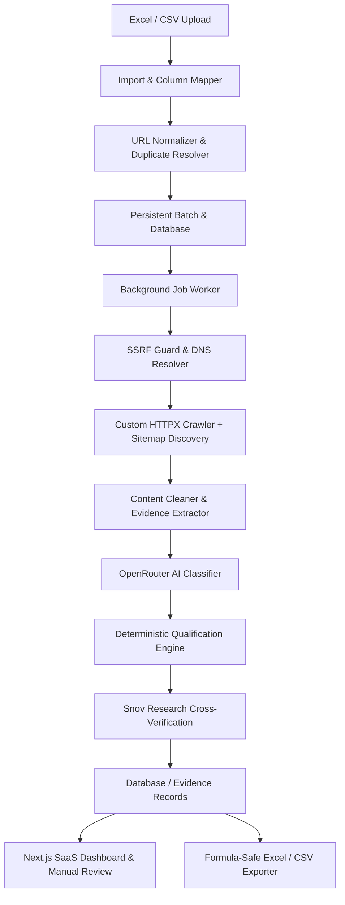

# LeadQualify AI - Architecture & Implementation Plan

LeadQualify AI is an enterprise-grade AI Website Qualification & Lead Filtering Platform. It evaluates company URLs from Excel/CSV workbooks, executes a custom SSRF-protected crawler to extract first-party business evidence, passes normalized business representations to OpenRouter AI, applies a deterministic qualification decision engine, verifies existing Snov research results, and delivers an evidence-backed SaaS dashboard with manual review and safe export capabilities.

## 1. System Architecture



## 2. Directory Structure

```text
/
├── backend/
│   ├── app/
│   │   ├── api/
│   │   │   ├── auth.py
│   │   │   ├── projects.py
│   │   │   ├── imports.py
│   │   │   ├── batches.py
│   │   │   ├── records.py
│   │   │   ├── export.py
│   │   │   └── stats.py
│   │   ├── core/
│   │   │   ├── config.py
│   │   │   ├── database.py
│   │   │   ├── security.py
│   │   │   └── ssrf.py
│   │   ├── crawler/
│   │   │   ├── fetcher.py
│   │   │   ├── discovery.py
│   │   │   ├── robots.py
│   │   │   └── extractor.py
│   │   ├── models/
│   │   │   └── entities.py
│   │   ├── schemas/
│   │   │   ├── ai_output.py
│   │   │   ├── api_models.py
│   │   │   └── qualification.py
│   │   ├── services/
│   │   │   ├── content_cleaner.py
│   │   │   ├── openrouter_service.py
│   │   │   ├── qualification_engine.py
│   │   │   ├── snov_verifier.py
│   │   │   ├── batch_runner.py
│   │   │   └── exporter.py
│   │   └── main.py
│   ├── migrations/
│   │   └── supabase_schema.sql
│   ├── tests/
│   │   ├── test_ssrf.py
│   │   ├── test_crawler.py
│   │   ├── test_content_cleaner.py
│   │   ├── test_qualification_engine.py
│   │   ├── test_snov_verifier.py
│   │   ├── test_import_export.py
│   │   └── test_api_pipeline.py
│   ├── requirements.txt
│   └── Dockerfile
├── frontend/
│   ├── src/
│   │   ├── app/
│   │   ├── components/
│   │   ├── lib/
│   │   └── types/
│   ├── package.json
│   ├── tailwind.config.ts
│   └── Dockerfile
├── docker-compose.yml
├── .env.example
└── README.md
```

## 3. Key Components & Implementation Details

1. **SSRF Guard (`backend/app/core/ssrf.py`)**:
   - Resolves domain to IP via `socket.getaddrinfo`.
   - Rejects loopback (`127.0.0.0/8`, `::1`), private (`10.0.0.0/8`, `172.16.0.0/12`, `192.168.0.0/16`), link-local (`169.254.0.0/16`, `fe80::/10`), AWS metadata (`169.254.169.254`), broadcast, multicast.
   - Restricts schemes strictly to `http` and `https` and default ports (80, 443, 8080, 8443).
   - Re-checks destination on every redirect.

2. **Custom Crawler (`backend/app/crawler/`)**:
   - Concurrent polite fetching using `httpx.AsyncClient` with user-agent, custom headers, and per-domain rate limiting.
   - Sitemap parsing (`sitemap.xml`) and internal-link prioritization (About, Services, Products, Contact, International Patient).
   - Content hashing and deduplication.

3. **Content Cleaner & Compressor (`backend/app/services/content_cleaner.py`)**:
   - Strips scripts, styles, cookies, headers, footers, navs, and marketing noise.
   - Prioritizes service descriptions, primary value propositions, customer segments, international patient facilitation programs.
   - Implements token budgeting while preserving citations and evidence hashes.

4. **Deterministic Qualification Engine (`backend/app/services/qualification_engine.py`)**:
   - Protects against LLM hallucinations: validates that every cited source URL was actually fetched.
   - Differentiates direct commercial providers from incidental blog mentions.
   - Cross-checks Snov existing result against first-party evidence.
   - Computes deterministic classifications: `MATCH`, `PARTIAL_MATCH`, `NOT_A_MATCH`, `NEEDS_REVIEW`, `UNVERIFIABLE`.

5. **Frontend Next.js SaaS UI (`frontend/`)**:
   - Modern, high-performance UI using Tailwind CSS and Lucide icons.
   - Dynamic interactive tabs: Overview Dashboard, Projects Configuration, Excel/CSV Importer with Column Mapping & Preview, Batch Monitor, Results Table with Multi-Facet Filtering, Evidence Drawer with Citation Inspector & Manual Override, and Formula-Safe Exporting.
